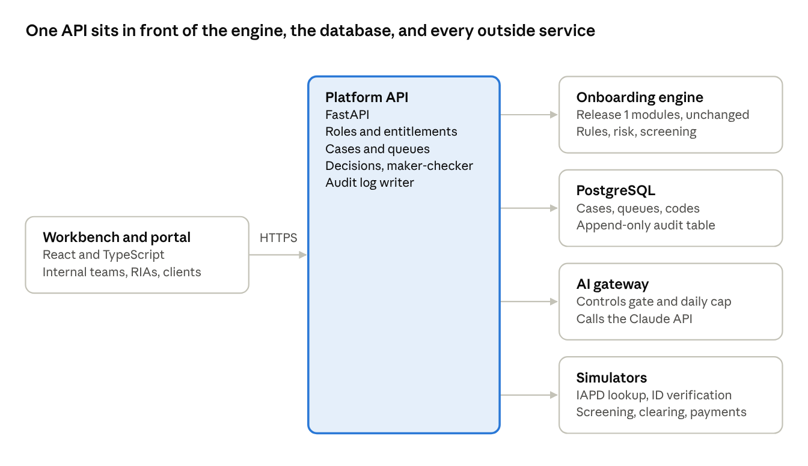
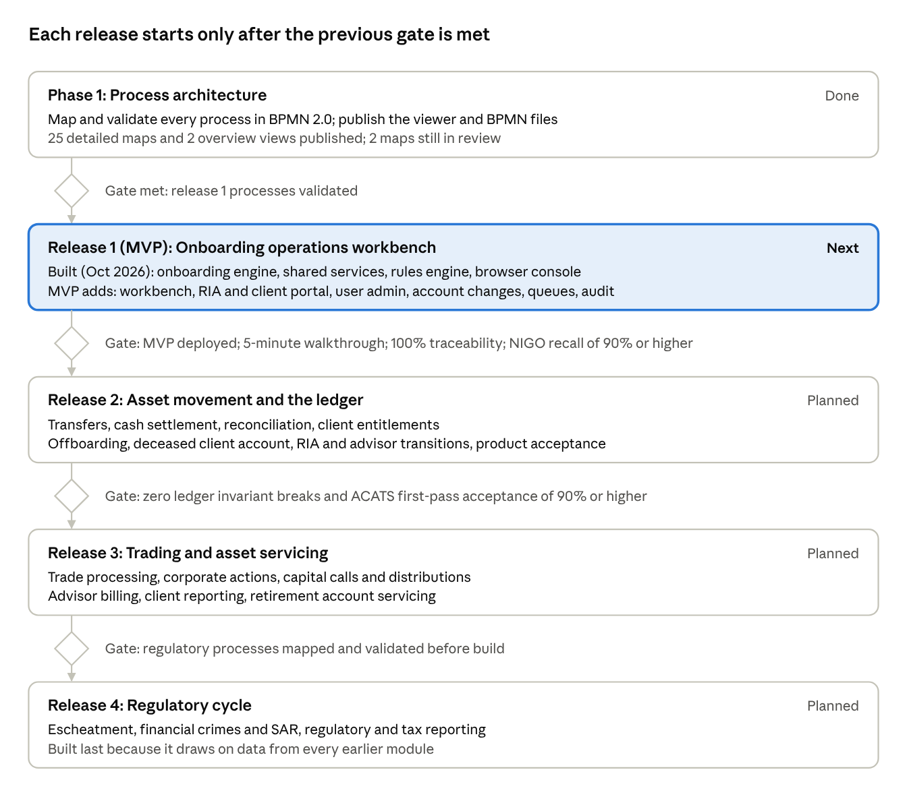

# PRD: AI-Embedded RIA Custody Operations Platform

Oct 10, 2026 · Shawn Ghodrati

## Overview

The product is an operations platform for RIA custody that runs the account lifecycle from RIA onboarding to escheatment. AI handles the messy inputs; deterministic rules and people make every decision; one three-layer ledger records the result.

- **Status:** Phase 1, the process architecture, is done: 25 detailed process maps, the platform overview, and the integration architecture are published. Release 1's onboarding engine is built and runs in a browser console.
- **Next:** the MVP, a deployed operations workbench for custody operations teams, built on that engine.
- **Form:** a product-grade web app on synthetic data, with simulated external connections behind production-shaped interfaces.
- **Links:** [live process viewer](https://shawngggg.github.io/AI-embedded-RIA-custody-operations-platform/) and [repository](https://github.com/shawngggg/AI-embedded-RIA-custody-operations-platform).

Vision: a custodian where an RIA's request is screened, decided, and posted the same day, with every AI suggestion, rule result, and human approval traceable in one audit trail.

## Problem and opportunity

RIA custody work stalls at the same few points: paperwork that arrives not in good order, transfers that get rejected, and handoffs between teams that lose time and evidence.

- **NIGO intake.** Account packages, entity documents, LPOAs, and change forms arrive incomplete. Each round trip to the RIA adds days.
- **Transfer friction.** ACATS rejects come from title and tax ID mismatches and from assets the custodian can't hold. LOIs and pre-transfer liquidations are handled by hand.
- **Line-to-line handoffs.** First-line operations escalates to sanctions and AML teams with evidence assembled manually, and holds wait on email.
- **Moving rules.** Reliance on RIAs for CIP rests on SEC staff relief tied to FinCEN's investment adviser AML rule, now effective January 1, 2028. Rules hard-coded today break when that date or scope moves.

The opportunity is to put AI on the unstructured work, such as reading documents, categorizing NIGO, predicting rejects, and assembling escalation evidence, while keeping decisions deterministic and auditable. In the author's prior operations work, an AI document-intelligence tool with a human review step cut NIGO exceptions by 40% and new-hire ramp time by 50%.

## Goals and non-goals

The product demonstrates a production-shaped custody platform end to end; it is not a licensed custodian or a live connection to market infrastructure.

**Goals**

1. Map every custody process in BPMN 2.0, validated against operating experience where it exists and labeled honestly where it doesn't.
2. Build release 1 as a product: the onboarding engine (built) and an MVP operations workbench, a deployed web app the custody operations team works in.
3. Show AI embedded safely: every AI output passes a rules check or a human approval before it changes an account.
4. Absorb regulatory change through effective-dated rules, not code changes.
5. Design every external connection behind an interface a production adapter could replace.

**Non-goals**

- Real client data, real money movement, or live connections to NSCC, DTC, Fedwire, FinCEN, or regulators. These require membership and certification; the demo uses simulators that produce and consume the public message formats.
- Legal advice. Regulatory references are design inputs, not compliance opinions.
- Depicting any specific firm's internal procedures, systems, or data.
- Judgment calls the custodian doesn't own. Sanctions determinations stay with the sanctions team; account entitlements and client and product suitability stay with the RIA.

## Users and roles

Eight roles use the platform, and the split between them is itself a control: whoever escalates never decides, and whoever places a hold isn't always the one who can lift it.

| Role | Does | Can't do |
| --- | --- | --- |
| Custody operations (first line) | Works intake, NIGO, transferability reviews, first-line flagged-list checks; refers unusual activity; escalates | Clear a sanctions or AML hold |
| AML compliance (second line) | Reviews EDD cases, risk escalations, fraud-pattern alerts; decides | Make sanctions determinations |
| Sanctions team (second line) | Screens official lists, issues the flagged list, decides escalations, reports to OFAC | Nothing restricted in the platform; it owns sanctions codes |
| Periodic review team | Runs risk-based periodic and trigger-event reviews of KYC, KYB, CIP, CDD, EDD, and PEP data | Change accounts outside a review |
| RIA authorized user | Submits applications, account changes (including beneficial owner updates), transfers, and money movement; places trades and posts fee files; sets account-level entitlements; owns client and product suitability on pure RIA accounts; has view-only access to the self-directed account | Act beyond its LPOA |
| RIA administrator | Adds the firm's users and grants their entitlements, within what the custodian allows the RIA | Grant more than the RIA's own permissions |
| Client | Trades in their designated self-directed account and brings cash and assets into it; uses any self-service capability the RIA grants; signs owner-level forms; submits changes on the self-directed account | Request changes to RIA-managed accounts outside the RIA channel; use self-service outgoing without a grant (a signed request or a receiving firm's ACATS transfer still works) |
| Platform administrator | Maintains rule versions and adapters; adds team members and assigns their roles | Approve cases or clear holds |

The MVP serves every role in this table: the internal teams in the workbench, and RIA users and clients in the portal.

## Product principles

Eight principles govern every module; a requirement that conflicts with one of them is wrong until the principle is changed on purpose.

1. **AI proposes; rules and people decide; the ledger records.** No AI output posts to an account without a deterministic check or a human approval.
2. **One three-layer ledger.** Client accounts roll up to the RIA master account, and RIA masters roll up to the custodian GL. Every posting is double-entry, and one that breaks the rollup is rejected.
3. **In transit is a ledger location.** Pending transfers sit in suspense accounts, so the books balance mid-transfer.
4. **First line escalates; second line decides.** Restriction codes carry an owner, and only the owning function can remove its code.
5. **The RIA is the channel and makes the investment decisions.** Applications, documents, account changes, money movement, and transfers come through the RIA; owner-level changes, such as beneficiaries and registration, carry the client's signature. Clients trade only in their designated self-directed account and can bring cash and assets into it; an RIA grant turns on self-service outgoing, and the client can always move assets out by signed request or a receiving firm's ACATS transfer. Account-level entitlements, client suitability, and product suitability rest with the RIA. The custodian provides the platform and holds the assets: it makes no investment judgment and decides only what its own obligations require, such as options and margin approval, AML and sanctions, fraud holds, legal process, and which assets it will hold.
6. **Shared subprocesses, not repeated steps.** Sanctions escalation, the transferability review, and restriction codes are built once and called everywhere.
7. **Rules are versioned, effective-dated, and cited.** Every decision records which rule version produced it and why.
8. **Production-shaped integration.** Every external system sits behind an interface, and simulators stand in until a real adapter exists.

## Account model

The platform supports two account groups, and dual-managed accounts are removed: every account is either managed by the RIA or self-directed by the client, never both.

| Aspect | Pure RIA accounts | Designated self-directed account |
| --- | --- | --- |
| Number per client | One or more | At most one, as an added benefit of the RIA relationship |
| Eligibility | Any RIA client | Requires at least one active RIA-managed account |
| Who trades | The RIA, with discretion | The client only |
| Suitability and fiduciary scope | The RIA's | Outside the RIA's management and fiduciary scope; the client's own decisions |
| Incoming cash and assets | Through the RIA | Allowed |
| Outgoing money movement and transfers | Through the RIA | Self-service with an RIA grant; the client can always transfer out by signed request or a receiving firm's ACATS request |
| Due diligence | Path A if the RIA is reliance-eligible, otherwise path B | Always path B, with account-level AML monitoring and trading surveillance |
| RIA visibility | Full | View-only, for planning |
| Billing | The RIA's fee schedule | The RIA's choice under its agreement |
| Margin and short selling | As the RIA entitles, after the custodian's options and margin approval; never in retirement accounts | As the RIA entitles, after the custodian's options and margin approval; never in retirement accounts |
| If the client's last RIA-managed account closes | Offboarding applies | Restricted to outgoing transfers; the client is told their options, then the account is transferred out and closed |

The split keeps accountability clean. An adviser's fiduciary duty applies to the whole relationship and can't be waived, though its scope follows the agreement ([SEC interpretation IA-5248](https://sec.gov/rules/interp/2019/ia-5248.pdf)); putting client-directed trading in its own account keeps that scope unambiguous. It also follows the author's observation that custodians are moving away from dual-managed and, in some cases, self-directed accounts.

## Scope and module inventory

The platform covers 26 processes and shared services, all now mapped: 12 are validated against operating experience, 11 are partially validated with the rest built from current regulation and industry practice, 2 are in review, and 1 is a proposed enhancement. The published viewer also includes an integration architecture view.

| Process | Area | Status | Target release |
| --- | --- | --- | --- |
| Platform overview | All | Overview | All |
| RIA firm onboarding | Onboarding | Validated | R1 |
| Client account opening (paths A and B) | Onboarding | Validated | R1 |
| Rolling review | Onboarding | Validated | R1 |
| Account maintenance | Account servicing | Validated | R1 (MVP) |
| Client entitlement management | Account servicing | Proposed enhancement | R2 |
| Sanctions escalation | Shared service | Validated | R1 |
| Transferability review | Shared service | Validated | R1 |
| Restriction codes | Shared service | Validated | R1 |
| Asset and money transfers | Asset movement | Partially validated | R2 |
| Cash settlement | Daily cycle | Validated | R2 |
| Position reconciliation | Daily cycle | Partially validated | R2 |
| Trade processing | Trading | Partially validated | R3 |
| Corporate actions | Asset servicing | Partially validated | R3 |
| Capital calls and distributions | Asset servicing | In review | R3 |
| Advisor billing | Periodic cycle | Validated | R3 |
| Client reporting | Periodic cycle | Validated | R3 |
| Client offboarding | Account lifecycle | Validated | R2 |
| Deceased client account | Account lifecycle | Partially validated | R2 |
| Escheatment | Regulatory cycle | Validated | R4 |
| RIA firm transitions (joining or leaving) | Account lifecycle | Partially validated | R2 |
| Advisor moves and RIA mergers | Account lifecycle | In review | R2 |
| Product acceptance | Onboarding | Partially validated | R2 |
| Retirement account servicing | Account servicing | Partially validated | R3 |
| Financial crimes and SAR | Regulatory cycle | Partially validated | R4 |
| Regulatory reporting | Regulatory cycle | Partially validated | R4 |
| Tax reporting | Regulatory cycle | Partially validated | R4 |

Validated means corrected against the author's operating experience. Partially validated means the steps the author performed are validated and the rest is a reference design built from current US regulation and industry practice. In review means a reference design awaiting that check.

## MVP: the custody operations workbench

The MVP is a deployed web app where a custody operations team works onboarding cases from application to open account, running on the release 1 decision engine. Internal teams work in the workbench. RIA users and clients sign in to a portal on the same platform, each seeing only their own firm's or their own accounts.

| User | Job in the MVP | First screen |
| --- | --- | --- |
| Operations analyst (first line) | Work intake and NIGO, run checks, request items, escalate | Own queue, oldest SLA first |
| Operations supervisor (first line) | Approve as checker, rebalance queues, watch aging | Team queues and SLA breaches |
| AML compliance | Decide EDD cases and compliance reviews | EDD and review queue |
| Sanctions team | Decide flagged-list escalations: release or block | Escalations with evidence packages |
| Periodic review team | Work reviews that come due by risk tier | Reviews due and overdue |
| Platform administrator | Maintain rule versions and demo data | Rule library and data reset |
| RIA administrator | Add the firm's users and grant their entitlements | Firm users and their entitlements |
| RIA user | Submit applications, documents, NIGO responses, and account changes for pure RIA accounts; track status | The firm's open requests and their status |
| Client | View the self-directed account and submit changes on it | The self-directed account and its requests |

**MVP requirements**

- MVP-1 Sign-in with role-based access for every user above; RIA users see only their firm, and clients only their own account. A public demo mode lets a visitor sign in as any role without a password.
- MVP-2 Cases persist. Each application becomes a case that stops where its map waits and resumes when the item, review, or decision arrives.
- MVP-3 Work queues by status (items requested, compliance review, sanctions review, EDD pending, review due), each with an owner, an SLA clock, and aging.
- MVP-4 Case view: the step trace along maps 01 and 02, rule findings with citations, documents, restriction codes, risk factors, and transfer routes.
- MVP-5 Intake by form, or by uploading a package that AI extracts behind the controls gate. Live Claude API calls are for signed-in users only, with a daily cap.
- MVP-6 Decisions are role-gated: only compliance signs off reviews, only the sanctions team records determinations, and only AML compliance approves EDD. Approvals need a second person (maker-checker).
- MVP-7 Restriction codes can be placed, viewed, and removed, with owner-only removal and the reason and authorization recorded.
- MVP-8 Rolling review: reviews come due by risk tier, and a missed refresh deadline places the no-new-activity code.
- MVP-9 Audit trail: every action, AI suggestion, rule version, and decision is appended to the log, viewable per case and exportable as JSON.
- MVP-10 Operations dashboard: queue counts, SLA breaches, straight-through rate, NIGO rate, and time spent in each waiting state.
- MVP-11 Synthetic data: seeded scenarios, more generated on demand, and a demo reset.
- MVP-12 User and entitlement administration. The platform administrator adds team members and assigns roles; an RIA administrator adds the firm's users and grants entitlements within the RIA's own permissions. Every grant is logged, and a grant of a decision role needs a second approver.
- MVP-13 RIA portal: RIA users submit applications, documents, and NIGO responses, and track each request's status.
- MVP-14 Account changes along map 04: the RIA submits changes to pure RIA accounts, including beneficial owner updates, with the client's signature on owner-level changes; the client submits changes on the self-directed account. Each change runs the authority, fraud-pattern, and flagged-list checks and re-runs due diligence when ownership changes.

Out of the MVP: fee posting, transfers, and trading, which join the same portal in releases 2 and 3 with the same entitlements; the ledger; and every later module except account maintenance. The current browser console stays as the no-sign-in preview.

## MVP architecture

The browser talks only to the API. The API runs the engine, writes every action to the audit table, and reaches Claude and the simulated outside services through their own adapters.

## Technology choices

The stack keeps the tested Python engine unchanged and puts a standard product web stack around it.

| Layer | Choice | Why |
| --- | --- | --- |
| Frontend | React and TypeScript, built with Vite | The common choice for product UIs; a typed client for the API |
| API | FastAPI (Python) | Runs the onboarding engine as is; typed requests and responses; generated API docs |
| Decision engine | The release 1 onboarding modules | Already built and covered by 177 tests; no rewrite |
| Database | PostgreSQL, with versioned migrations | Cases, queues, restriction codes, and an append-only audit table |
| Sign-in | Accounts with hashed passwords and role claims, plus demo sign-in by role | Mirrors the roles table; reviewers need no account |
| AI | Claude API through one AI gateway | One place for the API key, the daily cap (50 extractions), and the controls gate; about a tenth of a cent per extraction on Claude Haiku 5.5 |
| Testing and CI | pytest, Playwright end-to-end tests, GitHub Actions on every push | A merge to main needs every test passing |
| Hosting | Google Cloud Run for the API and the built frontend; Neon Free for PostgreSQL | Cloud Run's monthly free tier covers a demo's traffic and wakes in seconds. It needs a billing account, so the service runs with no minimum instances, at most one instance, and a budget alert. Neon Free is permanent, with 1 GB of storage |

## Release 1 requirements: onboarding and shared services

Release 1 delivers RIA firm onboarding, client account opening, the rolling review, and the three shared services every later module calls.

The decision engine for firm onboarding, account opening, and the shared services is built and tested (October 2026). The MVP workbench puts it in front of the operations team and adds the rolling review.

### RIA firm onboarding

- **RF-1** Accept an RIA application; AI extracts the custodial agreement, Form ADV, formation documents, and ownership chart into a case and categorizes NIGO items.
- **RF-2** Return incomplete packages to the RIA with itemized NIGO reasons, and re-extract on resubmission.
- **RF-3** Verify SEC or state registration, adviser licenses, and disciplinary history through the public-data adapter.
- **RF-4** Perform KYB and CIP on the firm, and verify the identity of owners and control persons.
- **RF-5** Screen owners and principals for PEP status and adverse media; AI summarizes hits for the reviewer.
- **RF-6** Check the firm and its principals against the sanctions team's flagged list; a hit calls sanctions escalation.
- **RF-7** Risk-rate the RIA; high risk routes to EDD on the owners' source of wealth and the firm's source of funds, with second-line approval.
- **RF-8** Determine reliance eligibility: SEC-registered, reliance contract on file, AML certification within the last 365 days. Store the result with its effective date.
- **RF-9** On approval, open master and house accounts, set authorized users and fee-deduction authority, and schedule the rolling review and certification timer.

### Client account opening

- **AO-1** Accept client-signed applications only from authorized RIA users, and only under an active RIA. Certification status affects the path, not whether the account can open. A self-directed account opens only for a client with an active RIA-managed account, one per client, with the client's acknowledgment that it sits outside the advisory scope; the RIA gets view-only access.
- **AO-2** AI extracts the application, title, LPOA, tax forms, and entity documents (formation, operating agreement, memorandum and articles); NIGO returns go to the RIA.
- **AO-3** Record the account type and the account group: pure RIA, or the client's one designated self-directed account. Retirement accounts are created with borrowing and short selling disabled, whatever the RIA's entitlements; options levels and margin need the custodian's own approval.
- **AO-4** Path A applies to a pure RIA account when the RIA is reliance-eligible. The custodian relies on the RIA for CIP and beneficial ownership under SEC staff relief (reliance contract and annual certification), uses RIA-provided information only, and never contacts the client. Reliance doesn't shift accountability: the custodian stays responsible for its AML program, SAR filing, and sanctions compliance.
- **AO-5** Path B applies to pure RIA accounts under an RIA that isn't reliance-eligible, and always to the self-directed account. The custodian verifies identity (documentary or non-documentary), performs CDD on purpose, expected activity, and entity owners, and enrolls the account in account-level AML monitoring and trading surveillance. Documents still come through the RIA; unverifiable identity follows the CIP failure procedure.
- **AO-6** Both paths get PEP and adverse media screening, the flagged-list check, and a risk rating. High risk routes to EDD with source of funds and source of wealth.
- **AO-7** On approval, create the account under the RIA master mapped to the GL, apply any restriction codes, schedule the rolling review, and run the transferability review on funding assets.

### Rolling review

- **RR-1** Schedule reviews by risk tier under policy, and start an early review on trigger events such as new screening hits or ownership changes. Demo default: high risk semi-annual, all others annual.
- **RR-2** AI pre-populates each review with KYC, KYB, CIP, CDD, EDD, and PEP data, plus changes and screening hits since the last review.
- **RR-3** Request updates from the RIA only; if the deadline passes, restrict new activity until the review is refreshed.
- **RR-4** Close with one of three outcomes: no change, profile updated (re-running the path decision if the RIA's reliance status changed), or risk increased (EDD, which can end in exit through offboarding).
- **RR-5** Run the same review on RIA firms: registration status, disciplinary events, ADV changes, and the reliance certification.

### Sanctions escalation (shared)

- **SX-1** Trigger on a flagged-list match on an entity, counterparty institution, product, or individual.
- **SX-2** Place a restriction code owned by the sanctions team immediately.
- **SX-3** AI assembles the evidence package (identifiers, date of birth, nationality, transliterations); operations reviews it and escalates.
- **SX-4** Prompt a follow-up when the escalation SLA passes.
- **SX-5** Release only on a sanctions-team determination, with the authorization logged; a true match stays blocked, and OFAC reporting stays with the sanctions team.

### Transferability review (shared)

- **XR-1** Run before every incoming or outgoing asset transfer.
- **XR-2** AI extracts positions from the statement and matches each to the security master.
- **XR-3** Check each position for the custodian's agreement with the asset manager and for ACATS, DTC, and Fund/SERV eligibility, then assign a disposition: ACATS in kind, LOI re-registration, or liquidation request.
- **XR-4** AI pre-fills LOIs and liquidation requests; operations reviews and sends them.
- **XR-5** Release the transfer, in full or in part, only when every position has a disposition. A position with no agreement can trigger a product-acceptance request.

### Restriction codes (shared)

- **RC-1** Each code carries a reason, a scope (full freeze, outgoing transfers only, no disbursements, no trading, or no new activity), an owner, a case link, and timestamps.
- **RC-2** An account can carry several codes; an action proceeds only if no code blocks it.
- **RC-3** Only the owning function can remove a code, and every placement and removal is audited.

### Rules engine

- **RE-1** Extend the existing onboarding execution engine: rules are versioned, effective-dated, and cited, and every decision logs the rule version that produced it.
- **RE-2** Add rule sets for reliance eligibility, the path decision, firm registration, PEP and EDD triggers, SOF and SOW requirements, flagged-list matching, and transferability.
- **RE-3** Fail safe: a rule that references a missing case field routes the case to human review instead of erroring.

## Later releases: module requirements

Later modules reuse release 1's shared services; each gets full requirements once its process map is validated.

| Module | Release | Core requirements | AI role |
| --- | --- | --- | --- |
| Account maintenance | R1 (MVP) | RIA intake for pure RIA accounts and client intake for the self-directed account, with the client's signature on owner-level changes; LPOA or client-signed-form authority check; fraud-pattern check confirmed with the RIA and a client callback; flagged-list check on new parties; due diligence re-run on ownership change; new bank links inactive until verified; notices to client and RIA | Classify the change; extract forms |
| Client entitlements | R2 | RIA grants or revokes client self-service capabilities, chiefly outgoing movement on the self-directed account (the client can always transfer out by signed request or ACATS), with limits, destinations, and expiry; verified bank link and OTP on every client request; account-type rules, such as no borrowing or short selling in retirement accounts, override any grant; options levels and margin stay custodian approvals; monitoring of client activity | Alert the RIA to unusual activity |
| Asset and money transfers | R2 | Requester permission check; flagged-list check; transferability review for assets; review of low-priced securities deposits; controls gate (dollar authority, maker-checker, RIA confirmation, client OTP, or callback on a signed request); pending and suspense postings; rail routing; wait for confirmation, reject, or timeout | Extract requests; predict rejects; triage exceptions |
| Cash settlement | R2 | Three-layer posting; rollup invariant check; unapplied-cash matching; returnable ACH funds held as restricted | Locate imbalances; match unapplied cash |
| Position reconciliation | R2 | Match client, RIA master, GL, and external records within tolerances; route breaks to auto-fix, AI-suggest, or human-only; escalate aged breaks; certify the books | Classify and cluster breaks; draft resolutions |
| Client offboarding | R2 | RIA notice, compliance exit, or a receiving firm's ACATS request; outgoing-transfers-only code; notice of the client's options; hold resolution; pro-rated final fee; outgoing transferability review and transfer; residual sweep; close at zero; when no RIA-managed account remains, the self-directed account is restricted to outgoing transfers and closed | Propose residual dispositions |
| Deceased client account | R2 | Restriction on credible notice from anyone; death certificate verification; RIA informed, its authority ended; full lockdown; instructions from the executor, surviving owner, or beneficiaries; clear ownership or legal process under state law; date-of-death basis; re-register, then journal or transfer out | Extract death certificate and ownership documents |
| RIA and advisor transitions | R2 | Firms joining: RIA onboarding, a batch plan, client-signed applications, LPOAs, and transfer forms (no negative consent), master and rep-code linking, batch transfers, basis reconciliation, billing from each funding date. Firms leaving: final fees before transfers validate, client-signed outgoing transfers, offboarding for accounts left behind, authority and fee deduction ended, six-month residual sweep. Advisor moves: new client-signed LPOA, re-link with no asset movement, hold only for a documented dispute or court order. Mergers: client consent for assignments (new LPOAs or an approved negative-consent package), records-only updates for rebrands, succession agreements reviewed before a successor acts | Read prior-custodian statements; flag likely rejects; reconcile basis; check LPOAs and signatures; extract deal terms |
| Product acceptance | R2 | Classify the product; fund agreements and Fund/SERV or DTC eligibility for funds and ETFs; sponsor background, audited financials, and sanctions screening plus operational feasibility (registration in the custodian's name, administrator, DTCC AIP, valuation) for alternatives; operations recommends, risk and compliance decide; security master setup and custody agreement; valuations posted with as-of dates; restriction or exit for products out of policy | Extract offering documents; check sponsors; check valuations |
| Trade processing | R3 | All orders execute in-house (no trade-aways); order-source rule: RIA orders on pure RIA accounts, client orders only in the designated self-directed account; enforce the trading permissions the RIA set, with no custodian suitability review; the custodian approves options levels and margin and supervises self-directed trading; reject borrowing and short sales in retirement accounts; settlement route per asset class; confirm matching; average-price allocation; settlement or fail cure | Screen orders; match confirms; triage fails |
| Corporate actions | R3 | Golden copy of terms; record-date entitlements; mandatory event handling; voluntary elections through the RIA; reconcile against the agent; claims | Normalize announcements; validate elections; draft claims |
| Capital calls and distributions | R3 | Validate notices against commitments; funding instruction through the RIA; settled-cash check; wire through transfers; wire instructions verified against subscription documents; tax character pending the K-1 | Extract notice terms |
| Advisor billing | R3 | Bill only a certified period; either fee method, the RIA's fee file or custodian calculation; reasonableness checks; the RIA chooses whether the self-directed account is billed; fee plans (tiered, flat, minimums, householding, advance or arrears); pro-ration; maker-checker; three-layer fee debit | Flag fee anomalies; parse fee schedules at onboarding |
| Client reporting | R3 | Monthly statements for accounts with activity, quarterly for all, from a closed period; quarterly performance; statement checks; e-delivery with consent or paper; corrected statements; duplicates and daily data feeds to the RIA | Draft commentary that must trace to the ledger |
| Retirement account servicing | R3 | Contribution limits and excess corrections; client-signed distributions with W-4R and state withholding and 1099-R codes; rollover, transfer, and Roth conversion eligibility and 5498 coding; January RMD statements and tracking; beneficiary claims against the designation on file, spousal options, inherited IRAs under the 10-year rule | Extract forms and claim documents; track unpaid RMDs |
| Escheatment | R4 | Dormancy by state rules; two Rule 17Ad-17 searches through a vendor; RIA lost-contact reports as a trigger; RIA-confirmed contact resets dormancy; uncashed-check notices; RIA outreach; due-diligence letter 60–180 days before the report; approval; remit cash and deliver securities in kind or liquidated under each state's rules; retirement accounts through the retirement team; NAUPA holder report | Review contact signals; match addresses |
| Financial crimes and SAR | R4 | First-line referrals and transaction monitoring; alert clustering and investigation; BSA/AML officer decision; filing through BSA E-Filing within 30 days of establishing suspicion (up to 60 with no suspect); five-year restricted records; risk-based monitoring after filing; 314(a) searches within two weeks; strict SAR confidentiality | Cluster alerts; assemble cases; draft narratives and filing fields |
| Regulatory reporting | R4 | CAT reporting by 8 a.m. ET on T+1, repairs by T+3; TRACE and MSRB RTRS within 15 minutes; Electronic Blue Sheet responses by the requested date; custody operations data support and pre-submission review; reject handling | Pre-submission reject checks; reject explanations; blue sheet response assembly |
| Tax reporting | R4 | Data fixes before forms go out; composite 1099, 1099-R, 5498, and 1042-S to clients with RIA copies; IRS filing through IRIS and direct state filing; corrected forms after reclassifications or questions; B-notices and 24% backup withholding | Flag data problems; find accounts hit by reclassifications; draft corrections |

## AI capabilities and guardrails

AI does six kinds of work, all upstream of a control; it never posts, decides a sanctions or AML case, or contacts a client.

**What AI does**

- **Extract:** documents into structured cases, with NIGO categorized by type (missing signature, mismatched title, expired ID, missing beneficial owner).
- **Predict:** likely ACATS rejects, order anomalies, and non-transferable positions before submission.
- **Match:** candidate addresses to owners, unapplied cash to accounts, executions to confirms, and positions to the security master.
- **Assemble:** evidence packages for sanctions escalations, break investigations, and transfer exceptions.
- **Draft:** LOIs, liquidation requests, follow-ups, claims, report commentary, and SAR narratives, each sent only after human review.
- **Monitor:** client-initiated activity for drift from the account's pattern, and contact signals for dormancy.

**Guardrails**

1. **One model gateway.** All model calls go through one interface that logs the model, prompt version, and output, so providers can change without touching workflows.
2. **Structured outputs.** Every response is validated against a schema; anything malformed or below its confidence threshold goes to a person.
3. **Data minimization.** Personal data is redacted or tokenized before a model call, and SAR case data goes only to an isolated model deployment approved for it, with no data retention, used only by the financial crimes team.
4. **Grounding.** Generated text that cites a number must trace it to the ledger, or it is rejected.
5. **Pre-release testing.** Each prompt or model change runs against a set of known cases, tracking extraction accuracy and false positives, before it goes live.
6. **Human feedback captured.** Every suggestion is stored with what the reviewer did (accepted, edited, or rejected) and feeds the next evaluation round.

These controls mirror the author's earlier rollout of an AI document tool: tested on known cases before release, a human review step on every AI-assisted determination, and approved prompts and templates.

### AI by function

In every function AI prepares the work and the platform submits it through the integration layer, but a person or a deterministic rule makes the call; for SAR filing that means AI drafts, a compliance officer approves, and the platform files.

| Function | AI prepares | Rules check | Person decides | Platform submits |
| --- | --- | --- | --- | --- |
| SAR filing | Clusters alerts across accounts; assembles the case file; drafts the narrative from case facts; pre-fills filing fields | Filing validated against FinCEN's schema; deadline clock of 30 days from establishing suspicion (up to 60 if no suspect is identified); risk-based monitoring after filing | Investigator recommends; BSA/AML officer approves or declines | SAR through FinCEN BSA E-Filing; acknowledgment stored; nothing disclosed to the RIA or client |
| Account statements and reports | Drafts performance commentary; flags anomalies such as a missing fee or negative balance before release | Period closed and certified; every number traced to the ledger | Analyst approves samples and exceptions | Statements and tax forms delivered straight to clients, copies to the RIA |
| Advisor billing | Parses fee schedules at onboarding; flags fee variances against the prior period and explains them | Fee engine, pro-ration, householding; self-directed billing only if the RIA chose it | Maker-checker approves the run | Three-layer fee debits; fee report to the RIA |
| Cash settlement | Predicts fails; matches unapplied wires and ACH to accounts; locates rollup imbalances | Three-layer invariant; net funding calculation | Analyst approves low-confidence matches and corrections | Settlement instructions to DTC, NSCC, the Fed, and the settlement bank |
| Reconciliation | Classifies and clusters breaks by root cause; proposes balanced correcting entries | Four-way match within tolerances; known break patterns auto-fixed | Analyst approves AI-suggested fixes; human-only breaks handled by hand | None external; books certified |
| Trading | Screens orders for anomalies; matches executions, allocations, and confirms; triages fails | Order source by account group; RIA permissions; approved options level; no borrowing or shorts in retirement accounts | Analyst resolves rejects and fails with the RIA | FIX to brokers; DTCC CTM; NSCC CNS, OCC, Fund/SERV |
| ACATS and transfers | Extracts prior-custodian statements; predicts rejects; pre-fills LOIs and liquidation requests; drafts reject corrections | Transferability review; controls gate | Analyst approves and sends | ACATS transfers, LOIs, wires, and ACH |
| Regulatory and tax reporting | Checks submissions for likely rejects; explains rejects; assembles blue sheet responses; flags tax data problems; drafts corrected forms | Format and deadline validation | Custody operations reviews; the reporting team approves | CAT, TRACE, MSRB RTRS, Electronic Blue Sheets, IRS IRIS |

SAR deadline source: [BankersOnline on the 30-day SAR clock](https://bankersonline.com/articles/107354).

## Integrations

The platform connects to 36 external systems across seven groups, each through an interface the core defines; the demo runs simulators for all of them, since live access to NSCC, DTC, Fedwire, FinCEN, or regulators requires membership or registration.

- **IN-1 Ports and adapters.** The core defines one interface per connection type (clearing agency, depository, payment rail, regulatory filer, tax filer, screening service, advisor data feed, AI model). Each external system plugs in through its own adapter, so a simulator and a production adapter are interchangeable.
- **IN-2 Translation at the edge.** Adapters map FIX, NACHA, ISO 20022, DTCC, and regulator formats to the shared schema and validate every inbound message before it reaches a workflow. Corrupted fields, such as malformed account numbers, are rejected at the door rather than discovered later as returns.
- **IN-3 Tracked messages.** Every message carries a unique ID, so retries and replays never double-post. Failures land in a dead-letter queue, and a daily interface reconciliation compares sent against acknowledged.
- **IN-4 Simulators.** Each adapter has a simulator that produces and consumes the public format with synthetic data.
- **IN-5 Secure connections.** Credentials live in a vault, every connection is authenticated and encrypted, and SAR traffic runs on a restricted path.
- **IN-6 Filing receipts.** Every regulatory or tax submission stores the regulator's acknowledgment or reject, linked to the case or report that produced it.

### Trading, clearing, and depositories

| System | Used for | Standard or channel | Modules | Release |
| --- | --- | --- | --- | --- |
| OMS and EMS, executing brokers | Orders, executions, trade-aways, allocations | FIX | Trade processing | R3 |
| DTCC CTM and ALERT | Institutional trade matching; standing settlement instructions | DTCC formats | Trade processing | R3 |
| NSCC Continuous Net Settlement (CNS) | Netting and settlement of equity and ETF trades | DTCC files and messaging | Trade processing, cash settlement | R3 |
| NSCC ACATS | Full and partial account transfers in and out (TIF, rejects, residual credits) | ACATS formats | Transfers, offboarding, transferability review | R2 |
| NSCC Fund/SERV and Networking | Mutual fund orders; account-level data exchange with fund companies | NSCC formats | Trade processing, reconciliation | R3 |
| NSCC Alternative Investment Products (AIP) | Alternative fund subscriptions, redemptions, and valuations | NSCC formats | Trade processing, capital calls | R3 |
| DTC | Depository settlement, deliveries, positions, DWAC, DRS, and FAST transfers | DTC formats, ISO 20022 | Cash settlement, transfers, reconciliation | R2 |
| DTCC corporate action announcements | Event terms for the golden copy | ISO 20022 corporate action messages | Corporate actions | R3 |
| OCC | Options clearing, exercise, and assignment | OCC formats | Trade processing | R3 |
| Fedwire Securities Service | Treasury and agency securities settlement | Federal Reserve formats | Trade processing, cash settlement | R3 |

### Payments and banking

| System | Used for | Standard or channel | Modules | Release |
| --- | --- | --- | --- | --- |
| Fedwire Funds Service | Domestic wires in and out | ISO 20022 (live since July 14, 2025) | Transfers, cash settlement | R2 |
| FedACH | ACH credits and debits, returns, notifications of change | NACHA | Transfers, cash settlement | R2 |
| FedNow and RTP | Instant payments | ISO 20022 | Transfers | R2 |
| SWIFT | Cross-border wires | ISO 20022, MT | Transfers | R2 |
| Settlement and sweep banks | Net funding, cash sweep balances, bank statements | Bank files and APIs | Cash settlement, reconciliation | R2 |
| Bank account verification and OTP services | Verifying client bank links; one-time passcodes on client requests | Vendor APIs | Client entitlements, transfers | R2 |

### Asset servicing and reference data

| System | Used for | Standard or channel | Modules | Release |
| --- | --- | --- | --- | --- |
| Transfer agents | DRS and DWAC movements; re-registration by LOI | DTC FAST, agent portals, letters | Transferability review, transfers | R2 |
| Fund administrators and general partners | Capital calls, distributions, NAVs, K-1s | Portals, PDFs, files | Capital calls, reconciliation | R3 |
| Pricing and security reference data | Prices, security master, ACATS and DTC eligibility flags | Vendor feeds | All modules | R2 |

### Due diligence and sanctions

| System | Used for | Standard or channel | Modules | Release |
| --- | --- | --- | --- | --- |
| Identity verification and CIP data | Documentary and non-documentary identity checks | Vendor APIs | Onboarding, maintenance | R1 |
| PEP, adverse media, and beneficial ownership data | Screening owners, principals, and account holders | Vendor APIs | Onboarding, rolling review | R1 |
| Sanctions team flagged list | First-line checks on entities, institutions, products, and individuals | List files from the sanctions team | Sanctions escalation, all modules | R1 |
| SEC IAPD and FINRA BrokerCheck | Registration, licensing, and disciplinary history | Public data, bulk Form ADV files | RIA firm onboarding, rolling review | R1 |
| E-signature and document intake | Signed applications, LPOAs, and forms | Vendor APIs | Onboarding, maintenance | R1 |
| Address search services | Lost securityholder searches under Rule 17Ad-17 | Vendor APIs | Escheatment | R4 |

### Regulatory and tax filing

| System | Used for | Standard or channel | Modules | Release |
| --- | --- | --- | --- | --- |
| FinCEN BSA E-Filing | SAR filing, and CTRs if currency is ever accepted | BSA XML, batch or system-to-system | Financial crimes | R4 |
| FinCEN 314(a) | Searching records against law enforcement subject lists | FinCEN secure system | Financial crimes | R4 |
| Consolidated Audit Trail (CAT) | Order and trade event reporting | CAT specifications | Regulatory reporting | R4 |
| FINRA TRACE and MSRB RTRS | Corporate, agency, and municipal bond trade reporting | Regulator specifications | Regulatory reporting | R4 |
| Electronic Blue Sheets | Responses to regulator trading data requests | EBS format | Regulatory reporting | R4 |
| IRS IRIS | Forms 1099, 1099-R, 5498, and 1042-S | IRIS, the only intake for 2026 tax-year filings onward | Tax reporting | R4 |
| State unclaimed property administrators | Holder reports, cash remittance, securities delivery | NAUPA format | Escheatment | R4 |

### Advisors, clients, AI, and internal systems

| System | Used for | Standard or channel | Modules | Release |
| --- | --- | --- | --- | --- |
| Advisor technology (portfolio management, CRM, rebalancing, billing, data aggregators) | Positions, transactions, fee files, account events | Platform APIs, webhooks, daily files | All modules | R1 |
| Statement, confirmation, and tax-form delivery | Delivery straight to clients, with copies to the RIA | Print-and-mail files, e-delivery portal, email | Client reporting, trade processing | R3 |
| AI model providers and document AI | Extraction, classification, matching, drafting | One model gateway | All modules | R1 |
| Custodian general ledger | GL postings and the daily three-layer proof | Journal files, APIs | All ledger postings | R2 |

Sources: [Fedwire ISO 20022 date (Federal Reserve Financial Services)](https://frbservices.org/news/fed360/issues/021825/wires-iso-20022-implementation-july-14); [FIRE to IRIS transition (IRS, IR-2026-99)](https://www.irs.gov/newsroom/irs-reminder-information-return-e-file-system-transitioning-to-a-new-platform); [Form 1042-S instructions (IRS)](https://www.irs.gov/instructions/i1042s). FIRE takes its last filings on November 19, 2026; IRIS, which has accepted Form 1042-S since the 2026 filing season, is the only IRS e-file channel from 2027.

## Platform APIs

RIAs and their technology vendors reach every RIA-channel action through APIs, and clients reach only what their account group and RIA grants allow.

| API | What it lets the caller do | Caller | Release |
| --- | --- | --- | --- |
| Onboarding | Submit RIA and account applications, upload documents, track NIGO items and status | RIA | R1 |
| Account data | Read balances, positions, transactions, cost basis, and restriction status; receive daily files | RIA, advisor tech vendors | R1 |
| Events (webhooks) | Receive status changes, NIGO requests, and holds; hold reasons appear only where disclosure is permitted | RIA, advisor tech vendors | R1 |
| Account maintenance | Submit change requests with signed forms, track status | RIA | R2 |
| Entitlements | Grant or revoke client capabilities, with limits and expiry | RIA | R2 |
| Money movement and transfers | Request wires, ACH, journals, and ACATS or non-ACATS transfers; track status | RIA; client for self-directed deposits and granted outgoing movement | R2 |
| Trading | Submit block orders and allocations (FIX also supported) | RIA; client in their self-directed account | R3 |
| Fee billing | Submit fee schedules or fee files, preview fees, retrieve billing results | RIA | R3 |
| Statements and documents | Retrieve statements, trade confirmations, and tax forms | RIA, client | R3 |
| Corporate actions | Retrieve events and entitlements; submit voluntary elections | RIA | R3 |
| Capital calls | Retrieve notices; submit funding instructions | RIA | R3 |

**API standards**

- **API-1 Authorization.** OAuth 2.0 with scopes tied to each RIA user's entitlements; a client token only ever reaches the client's own accounts.
- **API-2 Idempotency.** Every write takes an idempotency key, so a retry never creates a second transfer or order.
- **API-3 Versioning and limits.** Versioned endpoints, published rate limits, and deprecation notice before any breaking change.
- **API-4 Signed webhooks.** Webhook payloads are signed and can be replayed from an event log.
- **API-5 Sandbox.** A sandbox with synthetic data and the same simulators the demo uses.
- **API-6 Confidentiality.** No API ever reveals that a SAR exists or was filed.

## Core data model

Thirteen entities carry the platform; release 1 needs all but entitlements and ledger entries, which arrive in release 2.

| Entity | Key fields | Relates to |
| --- | --- | --- |
| RIA firm | Legal name, registration (SEC or state), status, reliance contract, certification date, risk rating | Authorized users, master account, accounts |
| Authorized user | Role, entitlements (submit, approve, manage client permissions) | RIA firm |
| Account | Account type (individual, joint, trust, IRA, entity), account group (pure RIA or self-directed), path A or B with effective date, status, risk rating, next review date | RIA firm, parties, restriction codes, entitlements |
| Party | Person or entity; role (owner, joint owner, trustee, beneficiary, beneficial owner, control person); tokenized identity data | Accounts, documents |
| Document | Type, extracted fields, NIGO categories, source, file hash | Case, party |
| Case | Type (onboarding, maintenance, review, escalation, transfer), state, owning function, SLA timers | Account or RIA, decisions, documents |
| Decision | Outcome, reason, rule version and citation, AI suggestion used, approver, timestamp | Case, rule |
| Rule | Version, effective from and to, citation, conditions, outcome | Decisions |
| Restriction code | Reason, scope, owner, placed and removed by and when | Account, case |
| Entitlement | Capability, limits, approved destinations, expiry, granted by | Account, authorized user |
| AI suggestion | Model, prompt version, output, confidence, reviewer action | Case, decision |
| Ledger entry and position | Layer (client, RIA master, GL), bucket (pending, settled, restricted), location (depository, suspense, bank), amount or quantity | Account, transfer |
| Integration message | Adapter, direction, format, status, acknowledgment | Case, ledger entry |

## Non-functional requirements

The platform must be able to reconstruct any case end to end: who asked, what AI suggested, which rule decided, who approved, and what posted.

- **NF-1 Auditability.** Decisions, AI suggestions, restriction-code changes, and rule versions are written to an append-only log, and any case can be replayed from it.
- **NF-2 Explainability.** Every decision shows its reason and rule citation in plain language to the reviewer and in the audit view.
- **NF-3 Access control.** Access is role-based and mirrors the roles table; sanctions and SAR data are restricted to their owning teams.
- **NF-4 Privacy.** Personal data is tokenized at rest and in AI prompts; the demo uses synthetic data only.
- **NF-5 Ledger integrity.** Every posting is double-entry, and the three-layer rollup is checked on every write; a failing posting is rejected, not corrected later.
- **NF-6 Idempotency.** Reprocessing any message or request never changes the outcome or double-posts.
- **NF-7 Configurability.** Rules, review cadence, confidence thresholds, and SLAs change through versioned configuration, not code.
- **NF-8 Responsiveness (demo target).** A rules-only decision returns in under 2 seconds, and an AI-assisted extraction in under 30 seconds.
- **NF-9 Usability.** The workbench and the browser console work by keyboard, on mobile, and in light or dark mode.

## Regulatory and compliance considerations

Two dates drive the onboarding design: reliance on RIAs for CIP is permitted through January 1, 2028, the same day FinCEN's investment adviser AML rule takes effect. Both are modeled as effective-dated rules. These are design inputs, not legal advice.

- **CIP and beneficial ownership reliance (path A).** Since 2004, SEC staff have let broker-dealers treat a registered investment adviser as if it were subject to an AML program rule for CIP reliance; the position covers beneficial ownership reliance since 2016. On December 3, 2025, staff extended it to January 1, 2028 ([SEC letter](https://www.sec.gov/files/tm/no-action/sifma-nal-120325.pdf)). Reliance is a staff enforcement position, not a transfer of liability: the custodian keeps its AML program, SAR, and OFAC duties. The relief addresses broker-dealer custodians; a bank custodian's reliance path is an open question.
- **Investment adviser AML rule.** FinCEN issued the rule on August 28, 2024, and on December 31, 2025 moved its effective date from January 1, 2026 to January 1, 2028 ([FinCEN release](https://www.fincen.gov/news/news-releases/fincen-issues-final-rule-postpone-effective-date-investment-adviser-rule-2028)). FinCEN intends to revisit its scope and the joint CIP proposal, so the reliance-eligibility rule set must accept a new version without code changes.
- **Beneficial ownership.** The CDD rule's beneficial ownership requirements for legal entity customers (31 C.F.R. § 1010.230) apply to entity accounts on both paths.
- **Sanctions.** OFAC obligations apply to every account regardless of path, so the sanctions team screens all holders; the platform adds first-line flagged-list checks and escalation, never determinations. On a confirmed match the sanctions team blocks the property, reports to OFAC within 10 business days, and keeps records for 10 years.
- **SAR confidentiality.** SAR case data is restricted to the financial crimes team, never disclosed to the RIA or client, and processed only by the isolated model deployment.
- **Custody statements.** Account statements go directly to clients, so outbound notices to clients continue even though requests flow through the RIA.
- **Client rights to their assets.** FINRA Rule 11870 limits a delivering firm's objections to an ACATS transfer to listed reasons, and Rule 15c3-3 gives customers their fully paid securities and cash on demand, so an RIA grant controls self-service features, not a client's right to leave ([FINRA Rule 11870](https://www.finra.org/rules-guidance/rulebooks/finra-rules/11870)).
- **Custodian approvals.** Options accounts need the broker-dealer's own approval under FINRA Rule 2360, and margin is the broker-dealer's credit. FINRA's intraday margin standard replaced the pattern day trader rule effective June 4, 2026, with implementation due by October 20, 2027 ([FINRA Regulatory Notice 26-10](https://www.finra.org/rules-guidance/notices/26-10)).
- **Authority at death.** The RIA's trading authority ends at the client's death. The custodian restricts the account on credible notice and takes instructions from the executor, a surviving owner, or beneficiaries.
- **SAR practice.** FinCEN's October 2025 SAR FAQs dropped the expectation of a separate 90-day continuing-activity review and of documenting decisions not to file; the platform still records a short rationale ([FinCEN SAR FAQs](https://www.fincen.gov/system/files/2025-10/SAR-FAQs-October-2025.pdf)).
- **Trade reporting.** CAT submissions are due by 8 a.m. ET on T+1, with repairs by T+3. TRACE and MSRB RTRS stay at 15 minutes; the SEC approved rescinding the 1-minute rule on September 16, 2025 ([CAT FAQ P16](https://www.catnmsplan.com/faq/p16); [SEC release 34-103986](https://www.sec.gov/files/rules/sro/finra/2025/34-103986.pdf)).
- **Advisory contract assignment.** Under Advisers Act §205(a)(2), an advisory contract can't be assigned without client consent, and a change of control counts as an assignment. Negative consent is common practice but not codified, so the platform takes new LPOAs or a custodian-approved negative-consent package with an opt-out period. An RIA moving custodians needs each client's own signed transfer forms.
- **Lost securityholders.** SEC Rule 17Ad-17 requires two database searches for lost securityholders and a written notice to unresponsive payees within seven months of an uncashed check ([eCFR](https://www.ecfr.gov/current/title-17/section-240.17Ad-17)). Escheated IRAs are distributions, with withholding and Form 1099-R reporting.
- **State-varying rules.** Dormancy periods, due-diligence windows, unclaimed-property deadlines, and estate procedures vary by state and are configured per state.

Sources opened October 5, 2026.

## Success metrics

The MVP succeeds when a first-time reviewer can work a case end to end in minutes, every decision is traceable, and AI measurably reduces NIGO rework on the synthetic test set; targets below are demo targets, not production benchmarks.

| Metric | Definition | Demo target | Release |
| --- | --- | --- | --- |
| Decision traceability | Share of decisions logged with rule version, citation, and approver | 100% | R1 |
| NIGO detection recall | Share of seeded NIGO defects the AI catches in the test set | 90% or higher | R1 |
| Straight-through opening | Share of clean synthetic applications opened with no manual step beyond approval | 70% or higher | R1 |
| AI suggestion acceptance | Share of AI suggestions accepted without edits | Tracked; no target yet | R1 |
| Escalation SLA adherence | Share of sanctions escalations answered within the SLA | Tracked | R1 |
| ACATS first-pass acceptance | Share of synthetic transfers accepted without a reject | 90% or higher | R2 |
| Ledger invariant breaks | Postings that break the three-layer rollup | 0 | R2 |
| Reviewer walkthrough | Time for a first-time reviewer to sign in and take a seeded case from application to open account | Under 5 minutes | R1 (MVP) |
| Role enforcement | Share of decision attempts by the wrong role that are refused and logged | 100% | R1 (MVP) |
| Build health | Share of merges to main with every test passing in CI | 100% | R1 (MVP) |

## Release plan

Phase 1 is done and release 1's engine is built; the MVP workbench is next, and each later release starts only when the previous gate is met.

Release 1's engine was built in October 2026 in eight milestones: data model and path decision, firm rules, restriction codes, flagged-list check, risk rating and EDD, transferability rules, AI extraction, and the demo console. No dates are set; each gate is passed on evidence, not on a calendar.

## Open questions, assumptions, and risks

The three MVP decisions are made (ticked below); what remains is validating two maps and the bank-custodian question.

**Open questions**

- [x] Map RIA and advisor transitions, product acceptance, retirement account servicing, financial crimes and SAR, and regulatory reporting.
- [ ] Validate the 2 processes still in review (capital calls and distributions; advisor moves and RIA mergers) against operating experience.
- [ ] Confirm how a bank custodian, as opposed to a broker-dealer, would rely on RIAs for CIP.
- [x] Hosting: Google Cloud Run for the app and Neon Free for PostgreSQL. Cloud Run's free tier (180,000 vCPU-seconds, 360,000 GiB-seconds, and 2 million requests a month per billing account) covers a demo, and it wakes in seconds. Render was set aside because its free app takes about a minute to wake and its free database is deleted after 30 days.
- [x] Live AI: signed-in users only, a cap of 50 extractions a day, and the illustrative response as the fallback. Team members are added by the administrator with role-based entitlements (MVP-12).
- [x] Path A covers beneficial ownership: the SEC staff extended the reliance position to the beneficial ownership requirements in 2016, and the Dec. 3, 2025 letter keeps it through Jan. 1, 2028. Operationally, the RIA keeps owner information current through account changes (MVP-14).

**Assumptions to confirm**

- When an RIA grants a client a money-movement or transfer capability on a pure RIA account, that client activity gets account-level monitoring.
- Changes that need the client's consent (beneficiary, title, bank instructions) arrive as client-signed forms submitted by the RIA.
- After an address or bank change, confirmation notices go to the client at the old and new addresses.
- Rolling review cadence is a risk-based policy choice, since the CDD rule sets no fixed schedule; the demo default (semi-annual for high risk, annual otherwise) is not drawn from practice.

**Risks**

| Risk | Mitigation |
| --- | --- |
| Scope is large for a solo build | The MVP is limited to the onboarding workbench; later releases wait for the MVP gate |
| FinCEN changes the adviser rule's scope or date again | Reliance and AML rules are effective-dated and versioned |
| AI misreads messy documents | Schema validation, confidence thresholds, human review, and pre-release test sets |
| The portfolio overstates hands-on experience | Validation status on every process, and reference-architecture framing throughout |
| Public demo abuse or AI cost | Live AI only for signed-in users, with a daily cap and the illustrative response as a fallback |
| Cloud charges beyond the free tier | No minimum instances, a one-instance ceiling, only the latest container image kept (0.5 GB of image storage is free), and a budget alert. A budget alert warns; it doesn't stop charges |

## Glossary

| Term | Meaning |
| --- | --- |
| ACATS | NSCC's automated system for transferring brokerage accounts between firms |
| CDD | Customer due diligence: understanding the customer relationship, including beneficial owners of entities |
| CIP | Customer identification program: collecting and verifying identity at account opening |
| Designated self-directed account | The one account per client, alongside RIA-managed accounts, where the client trades on their own, outside the RIA's management and fiduciary scope |
| EDD | Enhanced due diligence for higher-risk customers |
| Flagged list | The list of products, individuals, institutions, and entities the sanctions team issues for first-line checks |
| KYB | Know your business: due diligence on a firm |
| LOI | Letter of instruction sent to a sponsor, transfer agent, or administrator, used here to re-register assets outside ACATS |
| LPOA | Limited power of attorney giving the RIA trading and fee-deduction authority |
| NIGO | Not in good order: a submission missing or contradicting required information |
| Path A / path B | Path A relies on the RIA for client CIP and beneficial ownership; in path B the custodian performs due diligence |
| PEP | Politically exposed person |
| Restriction code | A coded hold on an account with a reason, a scope, and an owning function |
| RIA | Registered investment adviser |
| SOF / SOW | Source of funds (where this money came from) / source of wealth (how the client built overall wealth) |
| Three-layer ledger | Client accounts that roll up to the RIA master account, which rolls up to the custodian GL |

---

*Written with AI assistance (Claude) from the author's product decisions, process maps, and review. A reference design on synthetic data, not legal advice.*
