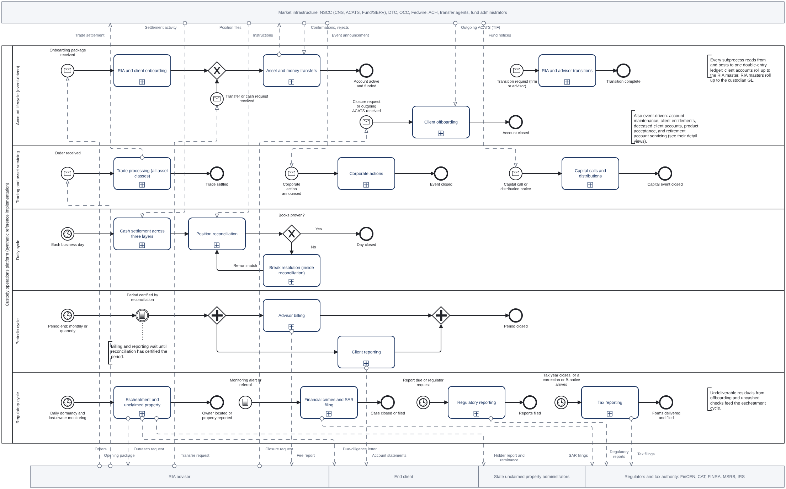
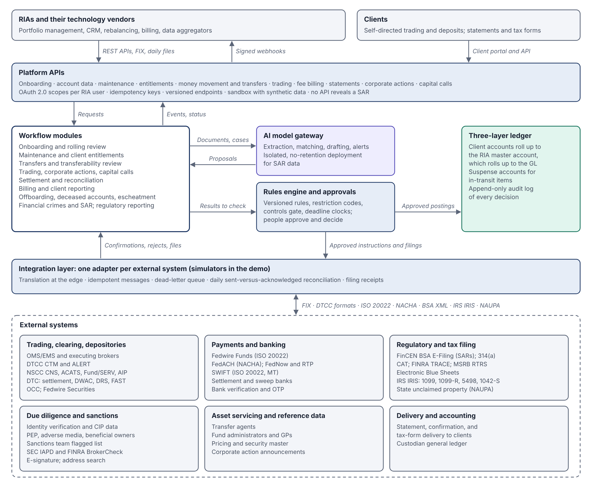

# RIA Custody Operations Platform: Process Architecture

**Live viewer:** https://shawngggg.github.io/AI-embedded-RIA-custody-operations-platform/

A BPMN 2.0 process architecture for an AI-embedded RIA custody operations platform: 25 detailed processes covering the full account lifecycle, from RIA firm onboarding and product acceptance through trading, settlement, billing, reporting, retirement servicing, transitions, offboarding, escheatment, and regulatory filings.

**Phase one**, mapping every process, is complete. **Phase two**, building the platform module by module, has started: the onboarding module is built and runs in the browser.



## Integration architecture

Every request enters through the platform APIs, every outbound instruction or filing passes the rules engine and a person's approval before the integration layer sends it, and AI reaches models only through its own gateway. The integration layer has one adapter per external system: clearing and depositories (NSCC, DTC, OCC, DTCC CTM), payment rails (Fedwire, FedACH, FedNow, RTP, SWIFT), regulators and tax (FinCEN BSA E-Filing, CAT, TRACE, MSRB RTRS, Electronic Blue Sheets, IRS IRIS, state unclaimed property), due diligence services, transfer agents and fund administrators, and advisor technology. The demo runs simulators that use the public message formats.



## Design principles

- **AI proposes; rules and people decide; the ledger records.** AI handles unstructured inputs and exceptions, such as document extraction, NIGO categorization, address matching, and break triage. Every decision passes a deterministic rules check or a human approval, and nothing AI produces posts to the ledger directly.
- **One three-layer ledger.** Client accounts roll up to the RIA master account, and RIA masters roll up to the custodian general ledger.
- **First line and second line stay separate.** Operations escalates; compliance and the sanctions team decide. Restriction codes can be removed only by the function that owns them.
- **The RIA is the channel and makes the investment decisions.** Account changes, money movement, and asset transfers come through the RIA, which owns account entitlements and client and product suitability; owner-level changes, such as beneficiaries and registration, carry the client's signature. The custodian provides the platform and holds the assets. It makes no investment judgment and decides only what its own obligations require: options and margin approval, AML and sanctions, fraud holds, legal process, and which assets it will hold.
- **Two account groups, no dual management.** A client has one or more pure RIA accounts managed by the RIA, and may have one designated self-directed account as an added benefit. The client trades and deposits there freely. An RIA grant turns on self-service outgoing money movement and transfers, and the client can always move assets out through a signed request or a receiving firm's ACATS transfer. The RIA has view-only access and decides whether to bill it, and keeping client-directed trading in its own account keeps the RIA's fiduciary scope unambiguous.
- **Validated where experienced, researched where not.** Steps I performed are validated against my experience. Steps I didn't perform are built from current US regulation and industry practice and labeled as reference design, and my own positions were checked against the rules.
- **Shared subprocesses instead of repeated steps.** Sanctions escalation and the transferability review are modeled once and called from onboarding, maintenance, transfers, and offboarding.
- **Built to connect.** The design assumes adapters for clearing (NSCC, DTC, OCC), payment rails, KYC and screening services, regulators, transfer agents, and AI model providers.

## Process inventory and review status

Each process is labeled by how far it has been validated:

| Process | Status |
|---|---|
| Platform overview | Overview |
| Integration architecture | Overview |
| RIA firm onboarding | Validated |
| Client account opening (paths A and B) | Validated |
| Product acceptance | Partially validated |
| Rolling review | Validated |
| Account maintenance | Validated |
| Client entitlement management | Proposed enhancement |
| Retirement account servicing | Partially validated |
| Sanctions escalation (shared) | Validated |
| Transferability review (shared) | Validated |
| Asset and money transfers | Partially validated |
| Trade processing | Partially validated |
| Corporate actions | Partially validated |
| Capital calls and distributions | In review |
| Cash settlement | Validated |
| Position reconciliation | Partially validated |
| Advisor billing | Validated |
| Client reporting | Validated |
| Client offboarding | Validated |
| Deceased client account | Partially validated |
| RIA firm transitions (joining or leaving with a book) | Partially validated |
| Advisor moves and RIA mergers | In review |
| Escheatment | Validated |
| Financial crimes and SAR filing | Partially validated |
| Regulatory reporting | Partially validated |
| Tax reporting | Partially validated |

- **Validated:** corrected against my operating experience.
- **Partially validated:** key steps validated; the rest is reference design built from regulation and industry practice.
- **In review:** reference design built from regulation and industry practice, awaiting validation.
- **Proposed enhancement:** a platform capability beyond standard practice.

Every process is now mapped: 11 are validated, 11 partially validated, 2 in review, and 1 is a proposed enhancement.

## Onboarding module

`onboarding/` holds the first platform module: RIA firm onboarding and client account opening, built along process maps 01 and 02. **[Try the onboarding console](https://shawngggg.github.io/AI-embedded-RIA-custody-operations-platform/console/)**: it runs the same Python code in your browser, stops where a map waits for a person, and lets you make that person's decision.

| Milestone | What it does | Code |
|---|---|---|
| 1. Data model and path decision | Account groups, Path A or B, reliance eligibility, the account-opening gate | `models.py` |
| 2. Firm and account rules | Registration and licensing, KYB, CIP, and CDD as effective-dated rules, each with a citation | `rules.py`, `firm_rules.py`, `account_rules.py` |
| 3. Restriction codes | Only the owning function can remove a code; removals that need a decision need an authorization reference; every attempt is logged | `restrictions.py` |
| 4. First-line flagged-list check | Name and identifier matching, sanctioned jurisdictions, OFAC's 50 Percent Rule, escalation to the sanctions team | `flagged_list.py` |
| 5. Risk rating and EDD | Cited risk factors, FATF lists by date, EDD requirements, review cadence | `risk.py` |
| 6. Transferability | ACATS in kind, letter of instruction, liquidation, or product acceptance for each position; full or partial release | `transferability.py` |
| 7. AI extraction | Claude structured outputs behind a deterministic controls gate: every value must be quoted from the documents | `extraction.py` |
| 8. Demo console | The module running in the browser through Pyodide | `docs/console/` |

`pipeline.py` runs the milestones in map order and returns a step-by-step trace, every rule finding with its source, the restriction codes placed, and an audit record.

The rules are dated, so the same application can get a different answer on a different date. The code tracks these changes:

- FinCEN's exceptive relief of Feb. 13, 2026: an entity's beneficial owners are identified at its first account, not at every new one.
- The SEC staff relief that lets a custodian rely on an RIA for CIP runs through Jan. 1, 2028; after that, accounts fall back to Path B unless the relief is extended.
- FATF's lists of June 19, 2026 drive the jurisdiction risk factors.
- The Syria sanctions program ended July 1, 2025.

To run it from the repo root:

```
pip install -r requirements.txt
python -m pytest onboarding -v      # 177 tests
python onboarding/demo.py           # every scenario, printed step by step
```

## Repository contents

| Path | Contents |
|---|---|
| `docs/index.html` | Interactive viewer (served by GitHub Pages) |
| `docs/diagrams/` | PNG image of every process |
| `bpmn/` | BPMN 2.0 XML files, editable in Camunda Modeler, bpmn.io, or Signavio |
| `onboarding/` | Onboarding module code and its tests |
| `docs/console/` | Browser console for the onboarding module (with copies of the modules it loads) |
| `tools/sync_console.py` | Copies the modules into the console after a change |

## Roadmap

1. Map every process (done) and validate the two maps still in review.
2. Build the onboarding module in Python, extending my [onboarding execution engine](https://github.com/shawngggg/onboarding-execution-engine) (policy-as-code KYC/AML rules), with a browser console (done).
3. Add the remaining modules (transfers, settlement, reconciliation, billing, reporting) and extend the console.

## Notes

- **Reference architecture.** Process content reflects my operating experience in RIA custody and brokerage operations, current US regulation, and industry practice. It does not depict any specific firm's internal procedures, systems, or data. All data and parties are synthetic.
- **How it was made.** The process content comes from my own review and corrections. The BPMN diagrams were produced with AI assistance (Claude). In the onboarding module, I wrote Milestone 1 (`onboarding/models.py`); its specification and tests were written with AI assistance. Milestones 2 to 8 were written by Claude (Anthropic's AI model) to the requirements in my process maps. The rule content is a reference design built from those maps and current regulation, not legal advice.
- **Third-party software.** The viewer embeds [bpmn-js](https://bpmn.io), licensed under the bpmn.io license; see `docs/BPMN-JS-LICENSE.txt`. Its watermark must remain visible. The onboarding console loads [Pyodide](https://pyodide.org) (Mozilla Public License 2.0) from jsDelivr.

## Author

**Shawn Ghodrati**, operations excellence, process improvement, and AI automation in banking, payments, and investment operations.
[LinkedIn](https://www.linkedin.com/in/shawngh) · [GitHub](https://github.com/shawngggg)
